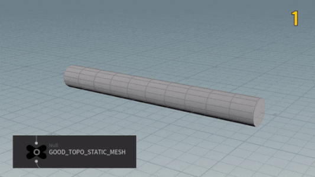
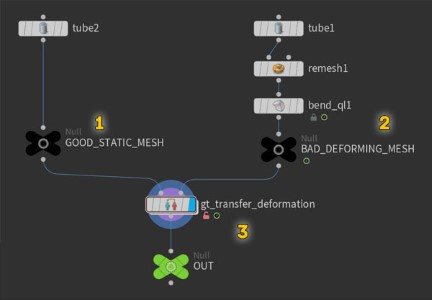
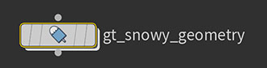
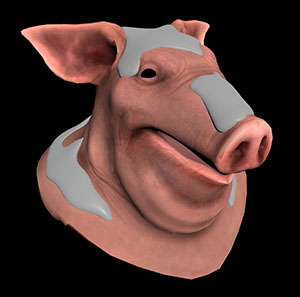
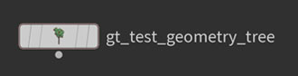
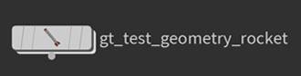

<!-- GT Houdini Assets Docs -->

<body>

<!-- Table of Contents -->

<h1> Table of Contents </h1>

<h3><b>General:</b></h3>
<ul>
  <li><a href="#installation">Installation</a></li>
</ul>
<h3><b>Geometry Operators:</b></h3>
<ul>
  <li><a href="#-gt-transfer-deformation-">GT Transfer Deformation</a></li>
  <li><a href="#-gt-snowy-geometry-">GT Snowy Geometry</a></li>
</ul>
<h3><b>Test Geometry:</b></h3>
<ul>
  <li><a href="#-gt-test-geometry-tree-">GT Test Geometry Tree</a></li>
  <li><a href="#-gt-test-geometry-rocket-">GT Test Geometry Rocket</a></li>
</ul>

 

<!-- Installation -->

<h1>Installation</h1>

<h3>🧰 Make Assets Always Available:</h3>
<ol>
	<li>Move your assets to a permanent safe location. (e.g. "Documents > my-houdini-assets")</li>
	<li>Open your "houdini.env" file (Located in "Documents > houdini##.#") using a text editor.</li>
	<li>Add a line defining a variable called "HOUDINI_OTLSCAN_PATH" pointing to the assets folder.  For example: <code>HOUDINI_OTLSCAN_PATH = C:/my-houdini-assets;&</code> (Use forward slashes)</li>
	<li>Restart Houdini.</li>
    <li>Enjoy!</li>
</ol>

<h3>🪓 One Time Use:</h3>
<ol>
	<li>Open your Houdini file.</li>
	<li>Go to "Assets > Install Asset Library..."</li>
	<li>Select which asset you want to load using the load dialog  (top right corner)</li>
	<li>Click on "Install" or "Install and Create"</li>
    <li>Enjoy!</li>
</ol>

<h3>📲 Using Houdini Engine (Maya):</h3>
<ol>
	<li>Load Houdini Engine.</li>
	<li>Go to "Houdini Engine > Load Asset..."</li>
	<li>Select the asset you want to load.</li>
	<li>Enjoy!</li>
</ol>
 

<!-- GT Transfer Deformation -->

<h1> GT Transfer Deformation </h1>

This node transfers deformation from one geometry to another even when their topologies are different. 
Plug your retopologized geometry on the left (first input) and the deforming geometry (usually bad topology) on the right (second input) 
In case the transfer was not 100% successful tweak the amount of sample points to fix it.  (more is better, but slower)

<b>Setup Example:</b>
 Both tube are identical, but the second one was remeshed and deformed.

  

<!-- GT Snowy Geometry -->

<h1> GT Snowy Geometry </h1>

Makes input geometry look like it's covered in snow. 
 It uses the normal of your input to determine what direction it should place points, and convert this points into a mesh that resembles snow.

 

<!-- GT Test Geometry Tree -->

<h1> GT Test Geometry Tree </h1>

Creates a stylized cartoon tree as a test geometry.

 

<!-- GT Test Geometry Rocket -->

<h1> GT Test Geometry Rocket </h1>

Creates a stylized rocket as a test geometry.

 

</body>
