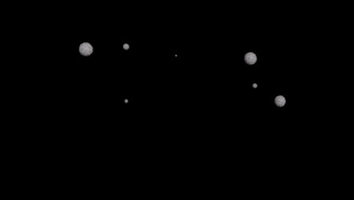
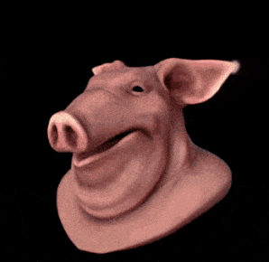

<!-- GT Houdini Assets Docs -->

<body>

<!-- Table of Contents -->

<h1> Table of Contents </h1>

<h3><b>General:</b></h3>
<ul>
  <li><a href="#installation">Installation</a></li>
</ul>
<h3><b>Geometry Operators:</b></h3>
<ul>
  <li><a href="#-gt-transfer-deformation-">GT Transfer Deformation</a></li>
  <li><a href="#-gt-snowy-geometry-">GT Snowy Geometry</a></li>
  <li><a href="#-gt-trace-to-plane-">GT Trace To Plane</a></li>
  <li><a href="#-gt-convert-to-cloud-">GT Convert To Cloud</a></li>
  <li><a href="#-gt-quick-fog-">GT Quick Fog</a></li>
  <li><a href="#-gt-quick-snow-">GT Quick Snow</a></li>
  <li><a href="#-gt-shrinking-particles-">GT Shrinking Particles</a></li>
  <li><a href="#-gt-voxelizer-">GT Voxelizer</a></li>
</ul>
<h3><b>Test Geometry:</b></h3>
<ul>
  <li><a href="#-gt-test-geometry-tree-">GT Test Geometry Tree</a></li>
  <li><a href="#-gt-test-geometry-rocket-">GT Test Geometry Rocket</a></li>
  <li><a href="#-gt-test-geometry-balloon-">GT Test Geometry Balloon</a></li>
</ul>

 

<!-- Installation -->

<h1> Installation </h1>
<h3>🧰 Make Assets Always Available:</h3>

<h4>Auto Installation</h4>

This asset collection comes with an auto installer (setup.bat) you can simply download it, run the setup and reopen Houdini.
Here is how you do it in more details:
<ol>
	<li>Close Houdini (in case it's opened).</li>
	<li>Download the latest release (or clone this repository).</li>
	<li>Un-zip (Decompress) the file you downloaded. (the setup won't work if it's still compressed)</li>
	<li>Open "setup.bat". (It will show you the options - "Install, Uninstall and About")</li>
	<li>Type "1" to "Install", then press enter.</li>
	<li>Open Houdini.</li>
	<li>Enjoy!</li>
</ol>

If you want, you can now delete the downloaded/extracted files (as they have already been installed)

<h4>Manual Installation</h4>

<ol>
	<li>Move your assets to a safe location. (e.g. "Documents > houdini#.# > gt-houdini-assets")</li>
	<li>Move the folder (or just the file) "packages" to "Documents/houdini#.#".</li>
	<li>Open the "gt-houdini-assets.json" file (Located in "Documents > houdini##.#" > packages) using a text editor.</li>
	<li>Edit the GTLIB variable to point to your assets folder.  For example: <code>"GTLIB": "C:/Users/USERNAME/Documents/houdini18.5/gt-houdini-assets",</code> (Use forward slashes)</li>
	<li>Restart Houdini.</li>
    <li>Enjoy!</li>
</ol>

<h3>🪓 One Time Use:</h3>
<ol>
	<li>Open your Houdini file.</li>
	<li>Go to "Assets > Install Asset Library..."</li>
	<li>Select which asset you want to load using the load dialog (top right corner)</li>
	<li>Click on "Install" or "Install and Create"</li>
    <li>Enjoy!</li>
</ol>

<h3>📲 Using Houdini Engine (Maya):</h3>
<ol>
	<li>Load Houdini Engine.</li>
	<li>Go to "Houdini Engine > Load Asset..."</li>
	<li>Select the asset you want to load.</li>
	<li>Enjoy!</li>
</ol>

<!-- GT Transfer Deformation -->

<h1> GT Transfer Deformation </h1>

This node transfers deformation from one geometry to another even when their topologies are different. 
Plug your retopologized geometry on the left (first input) and the deforming geometry (usually bad topology) on the right (second input) 
In case the transfer was not precise, tweak the amount of sample points to fix it.  (more is better, but slower)

<b>Setup Example:</b>
 Both tube are identical, but the second one was remeshed and deformed.

  

<!-- GT Snowy Geometry -->

<h1> GT Snowy Geometry </h1>

Makes input geometry look like it's covered in snow. 
 It uses the normal of your input to determine what direction it should place points, and convert this points into a mesh that resembles snow.

 

<!-- GT Trace To Plane -->

<h1> GT Trace To Plane </h1>

This node will automatically extract a shape from an alpha (black an white) image and convert it into a plane. 
Plug your black and white image under "Image Trace" and your color texture under "Image Color" then initialize the UVs.

 

<!-- GT Convert To Cloud -->

<h1> GT Convert To Cloud </h1>

This node will converts the input geometry into volumes that look like clouds. Very similar to the cloud and cloud noise nodes that come with Houdini, but with a few different options and controls.

 

<!-- GT Quick Fog-->

<h1> GT Quick Fog </h1>

Quickly generates a simple volume fog with parameters to customize Y and Z ramps, noise and mixing methods.

 

<!-- GT Quick Snow-->

<h1> GT Quick Snow </h1>

Quickly generates a simple particle system with a few parameters to customize its behaviour.
 This requires a sprite sheet to work. You can find examples in the <a href="./sprite_sheets">"sprite_sheets"</a> folder.
 To create new sprite sheets go into the IMG context and create a "Mosaic" node to convert a sequence of images into one sheet.
 Since this node uses sprites, it also requires the user to create a Sprite Fog material and assign it to the geometry with the correct sprite sheet path before being able to render it.

 

<!-- GT Shrinking Particles-->

<h1> GT Shrinking Particles </h1>

Uses the "@age" and "@life" to gradually decrease the size of "@pscale" so it looks like the particle is shrinking.  
A POP network already provides you with such attributes, just make sure to update the "Life Expectancy" under the "Birth" tab. 
By default, Houdini will not show the "@pscale" attribute on the viewport, so use the option "Output Test Spheres" for a preview. 

 

<!-- GT Voxelizer-->

<h1> GT Voxelizer </h1>

Converts the input geometry into a series of cubes that look like voxels. 
 The second input can be used to determine a custom shape for your "voxels".
  The "Inherit Input Point Color" can be used to transfer the color to the voxels, but it expects to find the attribute "@Cd" stored in Points. If your geometry has textures, use "Attribute from Map" to transfer it into the "@Cd" attribute.

 

<!-- GT Test Geometry Tree -->

<h1> GT Test Geometry Tree </h1>

Creates a stylized cartoon tree as a test geometry.

 

<!-- GT Test Geometry Rocket -->

<h1> GT Test Geometry Rocket </h1>

Creates a stylized rocket as a test geometry.

 

<!-- GT Test Geometry Balloon -->

<h1> GT Test Geometry Balloon </h1>

Creates a stylized balloon as a test geometry.

 

</body>
